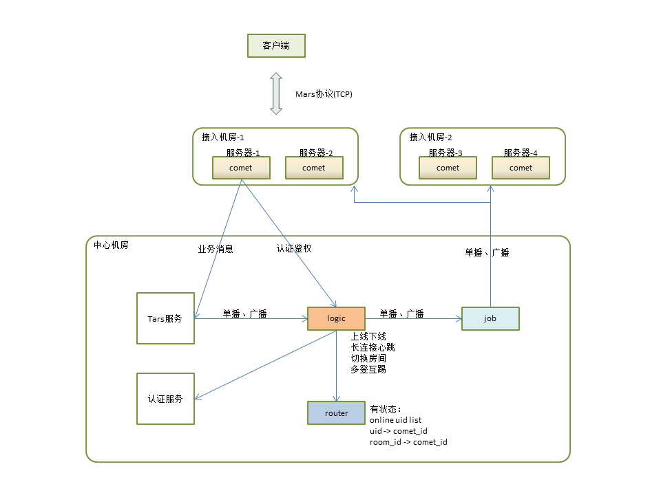

# 长连接和广播系统设计文档

## 架构设计

### 接入层

* 部署在接入机房
* 每个接入机房有多个接入进程comet
* 客户端利用智能DNS，根据自己的IP地址，就近接入

### 逻辑层

* 部署在中心机房
* logic进程，处理鉴权、上线、下线、心跳、房间切换、多登互踢，也提供单播广播、在线查询服务API
* router进程，存储用户ID到comet进程的映射关系，有状态
* job进程，转发单播广播消息
* 外部服务，如Tars服务、账号服务等

## 架构图

## 连接过程

## 推送过程

推送人是业务进程，由它发消息给logic进程，触发推送过程。

* 单播：业务进程发消息时，指定user_id
* 房间广播：业务进程发消息时，指定room_id

## 数据结构

router维护全局在线用户，是一个二级map `user_id -> conn_id -> server_id`。 

* user_id 是业务指定的，唯一标识一个用户
* conn_id 由存储进程分配，唯一标识该用户的一条连接
* server_id 标识这条连接属于哪个接入进程

接入进程维护自己在线用户，`user_id+conn_id -> Connection`

* Connection 是客户端连接的封装，可以向它推送消息

接入进程维护连接房间信息，`room_id -> ConnectionList`

## 问题

* Kafka不是必须的。[原作者解答为啥要Kafka](https://github.com/Terry-Mao/goim/issues/134)
* 在开源版上新增的功能
    * 支持上行业务消息
    * js sdk
    * 切换房间
    * 支持appid
    * router重启能重建在线用户
    * router支持在线扩容
    * comet重启，router能清理未下线用户
    * comet上报自己的地址给router (#d4dd4a0)，可用来实现自定义DNS
    * comet到logic负载均衡
    * 适配Tecent Mars客户端框架
    * 增加开关，可以不依赖Kafka和Zookeeper
* goim在B站用于[推送弹幕](https://zhuanlan.zhihu.com/p/22016939)。无法保证[在线实时消息的可靠投递](http://www.52im.net/thread-294-1-1.html)。
* 一条连接，只能在一个房间里。房间不等于[群聊](http://www.52im.net/thread-753-1-1.html)。
