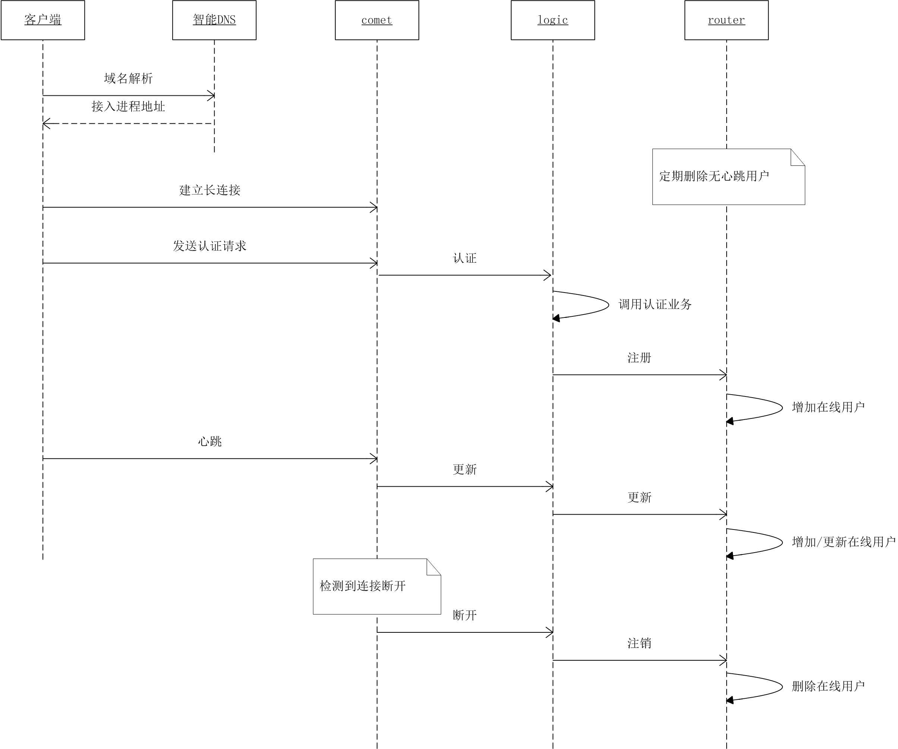

# 长连接和广播系统设计文档

## 原始需求

* 支持长连接
  + 适配客户端的通信协议 [Mars](https://github.com/Tencent/mars/wiki)
  + 适配客户端的通信协议 WebSocket
* 支持业务
  + 适配服务端的通信协议 [Tars](https://github.com/TarsCloud)
  + 注：一个更好的替代品是 [Micro](https://micro.mu)
* 支持单播和广播
  + 即服务器（通过长连接）主动发消息给客户端

### 通用封包的设计要点

  + RPCInput 客户端上行请求封包
  + RPCOutput 对应客户端请求的服务器应答封包
  + ServerPush 服务器主动下发的通知封包
  + MultiPush 用于服务之前，批量单播封包
  + 注：参考 [brpc](https://github.com/brpc/brpc/blob/master/docs/cn/baidu_std.md)
  + 注：ServerPush 的 URI 区分，其最佳实践为 `ServiceName/NotifyType`，与 RPC 的 URI 区分 `ServiceName/MethodName` 对应起来。即 P2P 的每个交易，应该有 `Request/Response/Notify` 三种消息。
  + 参考 [IM开发干货系列文章](http://www.52im.net/thread-294-1-1.html)

goim 本质上是 IM 系统的基础设施。目标是支持全球多数据中心，百万在线用户，千万日活跃度的互动应用。其典型的应用场景有游戏、直播、即时提醒、实时图表、弹幕、聊天、屏幕同步等。

## 架构设计

名词解释

* comet 客户端直连的边缘接入进程
* logic 中心逻辑服务
* job 中心推送服务
* router 中心路由存储服务

### 接入层

* 部署在接入机房
* 每个接入机房有多个接入进程comet
* 客户端利用智能DNS，根据自己的IP地址，就近接入

### 逻辑层

* 部署在中心机房
* logic进程，处理鉴权、上线、下线、心跳、房间切换、多登互踢，也提供单播广播、在线查询服务API
* router进程，存储用户ID到comet进程的映射关系，有状态
* job进程，转发单播广播消息
* 外部服务，如Tars服务、账号服务等

## 架构图

## 连接过程

## 推送过程

推送人是业务进程，由它发消息给logic进程，触发推送过程。

* 单播：业务进程发消息时，指定user_id
* 房间广播：业务进程发消息时，指定room_id

## 数据结构

router维护全局在线用户，是一个二级map `user_id -> conn_id -> server_id`。 

* user_id 是业务指定的，唯一标识一个用户
* conn_id 由存储进程分配，唯一标识该用户的一条连接
* server_id 标识这条连接属于哪个接入进程

接入进程维护自己在线用户，`user_id+conn_id -> Connection`

* Connection 是客户端连接的封装，可以向它推送消息

接入进程维护连接房间信息，`room_id -> ConnectionList`

## 问题

* 不用 redis 的原因是
    * 仅需要提供原子性RPC-CRUD内存操作：例如Put同时Counter++, redis要lua
    * 能支持多核并行：单进程能吃满服务器资源，减少运维复杂度
    * 进程内分桶，减少锁竞争：桶数量可配置很多；类似redis的scan
    * 强类型的复杂数据结构：redis仅支持二级kv, v还有json序列化开销
    * 灵活的脏数据清理策略：redis的TTL大多没用
    * redis从库？通过logic异步多写来做
* Kafka不是必须的。[原作者解答为啥要Kafka](https://github.com/Terry-Mao/goim/issues/134)
* 在开源版上新增的功能
    * 支持上行业务消息
    * js sdk
    * 切换房间
    * 支持appid
    * router重启能重建在线用户
    * router支持在线扩容
    * comet重启，router能清理未下线用户
    * comet上报自己的地址给router (#d4dd4a0)，可用来实现自定义DNS
    * comet到logic负载均衡
    * 适配Tecent Mars客户端框架
    * 增加开关，可以不依赖Kafka和Zookeeper
* goim在B站用于[推送弹幕](https://zhuanlan.zhihu.com/p/22016939)。无法保证[在线实时消息的可靠投递](http://www.52im.net/thread-294-1-1.html)。
* 一条连接，只能在一个房间里。房间不等于[群聊](http://www.52im.net/thread-753-1-1.html)。

## 高性能分析

容量规划：（阿里云主机16C32G-2.5GHz，预留50%余量）

* 10,000 conn per comet
* 100 comet
* 50 logic/router/job co-located
* or 改进：
  + 10 logic
  + 5 job
  + kafka cluster
  + zookeeper cluster
  + 10 router

瓶颈 CPU > 带宽 > 内存

内部通信无瓶颈，可水平扩容的路径有：

* 客户端发起的RPC mobile -> comet -> micro
* 上线/下线/切换房间/心跳 mobile -> comet -> logic -> router
* 单播 micro -> logic (-> router) -> job -> comet -> mobile
* 在线信息查询
  + 按用户查在线查房间 /session

内部通信，可能有瓶颈的路径：

* 批量单播  micro -> logic ((N-parallel)-> router) -> job -> comet -> mobile 
  + 限制：一批用户总数，不宜过多
* 广播 micro -> logic -> job -> comet -> mobile 
  + 限制：由于job定期absorb comet上的room list, so job数量不可过多
  + 改进：logic和job解耦，用kafka连接。由于 job 对 CPU 的消耗在 comet/logic/router 中最少，只需要非常少的 job 实例就行。
* 在线信息查询
  + 查在线总数 /count 由于logic定期absorb router上的room users，只能是有限的logic打开counter定时查
  + 按房间查用户 /room 同 /count
  + 遍历 /list 调试用接口，别用于服务

## 高可用分析

goim 是 IM 系统的基础设施，其支撑的上层应用需要为用户提供 7-24 小时无间断服务。迭代式开发，要求 goim 内在模块和业务服务的升级、扩容对用户无感知。

* comet 重启、升级时，客户端检测到连接断开，自动重连到另一个 comet 
* logic 重启、升级时，comet、micro 会自动寻找下一个 logic
* job 重启、升级时，有其它 job 继续消费 kafka
* router 重启、升级时，由备 router 顶上；升级完成，切回主 router

## 可扩展性分析 

内建插件模式：

* 客户端协议，已经适配 TCP(Mars) WebSocket，未来可以支持 socket.io 
* 服务端协议，已经适配 Tars，未来可以支持 Micro，或者 gRPC
* 认证鉴权协议，开放给外部，可定制

## 低成本、安全

* 几乎没有外部依赖，极低的运维成本 (kafka可选，kafka自带zk可以用来作节点发现)
* 高性能的代码实现，节省服务器成本
* 集成认证鉴权，也支持 HTTPS 
