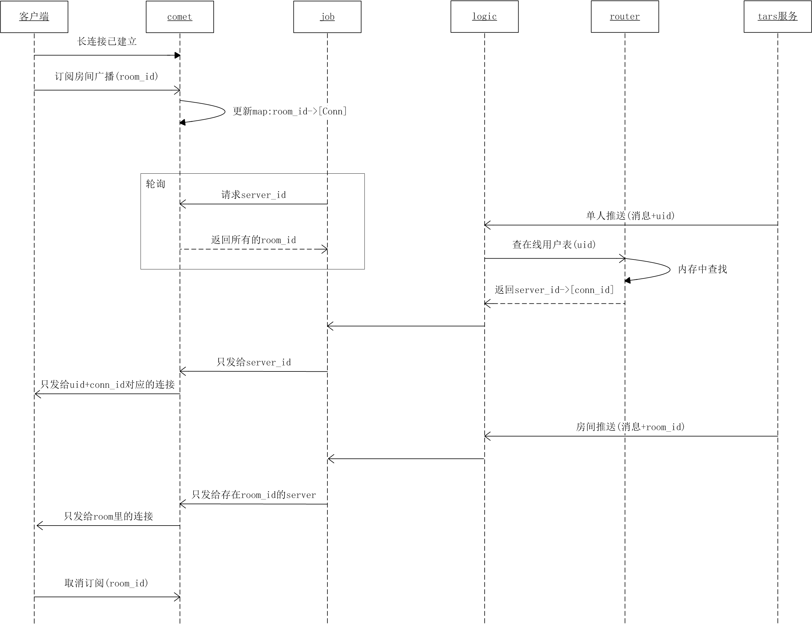

# 长连接和广播系统设计文档

## 架构设计

### 接入层

* 部署在多个接入机房
* 每个接入机房有多个接入进程
* 客户端利用智能DNS，根据自己的IP地址，就近接入

### 逻辑层

* 部署在多个中心机房
* 每个机房有如下进程
    * 逻辑进程，处理连接认证、注册和注销
    * 存储进程，存储用户ID到接入进程的映射关系
    * 推送进程，转发推送消息

### 存储层

* 部署在中心机房，与逻辑层在一起
* 存储在线用户表，多机房同步
* 存储推送消息

## 架构图

## 连接过程

## 推送过程

推送人是业务进程，由它发消息给逻辑进程，触发推送过程。

* 广播：广播消息由推送进程发给所有的接入进程，不用查表
* 单人推送：业务进程发推送时，指定user_id
* 分组推送：业务进程发推送时，指定group_id

## 数据结构

存储进程维护全局在线用户，是一个二级map `user_id -> conn_id -> server_id`。 

* user_id 是业务指定的，唯一标识一个用户
* conn_id 由存储进程分配，唯一标识该用户的一条连接
* server_id 标识这条连接属于哪个接入进程

接入进程维护自己在线用户，`user_id+conn_id -> Connection`

* Connection 是客户端连接的封装，可以向它推送消息

接入进程维护连接分组信息，`groupid -> ConnectionList`

